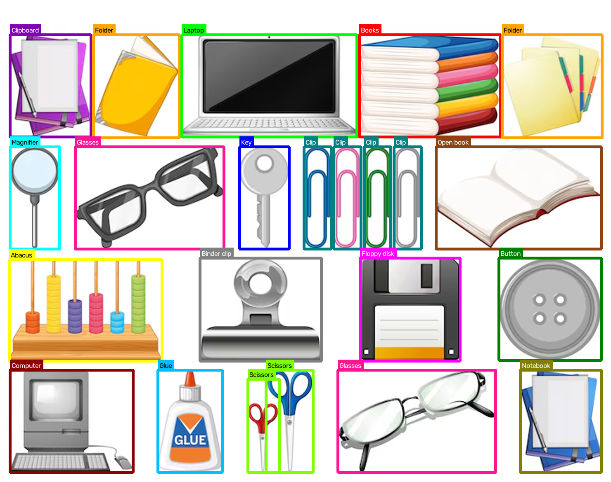

# Bounding boxes con OpenCV

Actividad individual de Visión por Computadora basada en el tutorial *Drawing a Bounding Box with OpenCV*, que es el paso previo a la detección de objetos con YOLO.

El proyecto carga una imagen con muchos objetos de clases distintas, dibuja una caja de color alrededor de cada uno, escribe el nombre de la clase encima de cada caja y propone un método para detectar los objetos de forma automática.

## Resultado



Se marcaron **23 objetos de 17 clases**: portapapeles, carpetas, laptop, libros, lupa, lentes, llave, clips, libro abierto, ábaco, pinza, disquete, botón, computadora, pegamento, tijeras y cuaderno. Todas las cajas tienen grosor 5 y las de la misma clase comparten color, igual que en los detectores de objetos reales.

La imagen de entrada es una ilustración de objetos de oficina sobre fondo blanco, de Freepik. Las coordenadas de las cajas se midieron sobre esa imagen.

## Qué hace el notebook

El archivo `notebooks/bounding_box_opencv.ipynb` tiene dos partes.

**Tutorial.** Es el del profesor y se conserva sin cambios, con sus resultados guardados. Instala y verifica OpenCV, carga una imagen, la muestra con Matplotlib y dibuja una primera caja con `cv2.rectangle`. Usa la imagen del gato del profesor, que no está incluida en este repositorio, así que esas celdas no se vuelven a ejecutar.

**Actividad individual.**

1. **Carga de la imagen.** Se lee con `cv2.imread`, se comprueba que la ruta sea correcta y se prepara para dibujar.
2. **Cajas de colores.** Cada objeto se define con su clase y sus coordenadas `(x1, y1, x2, y2)`. Se dibuja con `cv2.rectangle`, color según la clase y grosor 5. Una de las clases es amarilla.
3. **Etiquetas.** El nombre de cada clase se escribe con `cv2.putText` encima de su caja, sobre una franja del color de la clase para que se lea bien.
4. **Resultado.** La imagen final se muestra con Matplotlib y se guarda en `reports/resultado.png`.
5. **Detección automática.** Se explica cómo detectar objetos sin coordenadas manuales usando YOLO.

### Decisiones de implementación

- **Un color por clase.** Los 4 clips comparten un color, y lo mismo pasa con las 2 carpetas y las 2 tijeras. Así las cajas se distinguen por clase, como en cualquier detector.
- **Etiquetas legibles.** El texto de cada etiqueta es blanco sobre las franjas oscuras y negro sobre las claras, según la luminosidad del color de la clase.
- **Imagen ampliada 2x.** La imagen original mide 740 x 555 píxeles. Se agranda al doble dentro del código para que las cajas de grosor 5 no tapen objetos angostos como los clips o la llave. El archivo original no se modifica.
- **Margen blanco arriba.** Se agrega un margen de 60 píxeles en la parte superior para que las etiquetas de las cajas de arriba queden encima de su caja y dentro de la imagen.
- **Coordenadas en la imagen original.** La lista `objects` guarda las coordenadas medidas sobre la imagen de 740 x 555 y una función las convierte a la imagen ampliada.
- **Copia de trabajo.** Las cajas y las etiquetas se dibujan sobre copias (`img.copy()`), así la imagen cargada queda intacta.

## Método de detección automática: YOLO

YOLO (*You Only Look Once*) es una red neuronal convolucional que analiza la imagen completa en una sola pasada. Para cada zona de la imagen predice directamente las coordenadas de la caja `(x, y, w, h)`, una confianza de que ahí hay un objeto y una probabilidad por clase. El resultado bruto tiene miles de cajas candidatas, así que se aplican dos filtros:

1. **Umbral de confianza.** Se descartan las cajas con puntaje bajo.
2. **Supresión de no máximos (NMS).** Cuando varias cajas cubren el mismo objeto, solo se conserva la de mayor puntaje.

Las cajas que quedan se pueden dibujar con las mismas funciones de este proyecto, `cv2.rectangle` y `cv2.putText`. Como corre en una sola pasada, YOLO es lo bastante rápido para usarse en video en tiempo real.

## Cumplimiento de la rúbrica

| Criterio | Puntos | Dónde se cumple |
|---|---|---|
| 1. Carga de imagen | 1 | `cv2.imread` con ruta relativa y validación de que el archivo exista |
| 2. Cajas | 3 | Colores por clase, una clase amarilla y grosor 5 en todas las cajas |
| 3. Etiquetas | 2 | `cv2.putText` encima de cada caja, con franja de color para que se lea |
| 4. Detección automática | 4 | Explicación de YOLO, con umbral de confianza y NMS |

## Estructura del proyecto

```
notebooks/
    bounding_box_opencv.ipynb    Notebook con el tutorial y la actividad resuelta
data/
    images/
        objetos_oficina.png          Imagen de entrada con los objetos
reports/
    resultado.png                Imagen final con cajas y etiquetas
requirements.txt                 Dependencias de Python
README.md                        Este archivo
```

## Requisitos

- Python 3.10 o superior (el proyecto se desarrolló con Python 3.14)
- Las librerías de `requirements.txt`: NumPy, Matplotlib, OpenCV, Pillow, Jupyter, ipykernel y nbformat

## Cómo ejecutarlo

### 1. Clonar el repositorio

```bash
git clone https://github.com/DanielSozoranga/vision-computadora-bounding-box.git
cd vision-computadora-bounding-box
```

### 2. Crear y activar el entorno virtual

En Linux, macOS o WSL:

```bash
python3 -m venv vision-bbox
source vision-bbox/bin/activate
```

En Windows con PowerShell:

```powershell
python -m venv vision-bbox
vision-bbox\Scripts\Activate.ps1
```

En Ubuntu o WSL puede hacer falta instalar antes el paquete de entornos virtuales:

```bash
sudo apt update && sudo apt install -y python3-venv python3-pip
```

### 3. Instalar las dependencias

```bash
pip install --upgrade pip
pip install -r requirements.txt
```

Para comprobar que todo quedó bien:

```bash
python -c "import cv2, matplotlib; print(cv2.__version__)"
```

Si en Linux o WSL aparece el error `libGL.so.1: cannot open shared object file`, se soluciona con:

```bash
sudo apt install -y libgl1
```

### 4. Abrir el notebook

Con Jupyter:

```bash
jupyter lab
```

Con VS Code: abre `notebooks/bounding_box_opencv.ipynb`, pulsa **Select Kernel** y elige el entorno `vision-bbox`. Si no aparece, regístralo con:

```bash
python -m ipykernel install --user --name vision-bbox --display-name "Python (vision-bbox)"
```

Después ejecuta las celdas de la sección **Individual Activity**, que son los puntos 1 a 4, una por una o con **Execute Cell and Below** desde el primero. Las rutas son relativas a la carpeta `notebooks/`, así que no hay que cambiar nada. Si usas **Run All**, se detendrá en la celda del tutorial que carga el gato del profesor (`cat.jpg`), porque esa imagen no está en el repositorio.

## Usar otra imagen

1. Copia la imagen a `data/images/`.
2. En el notebook cambia la ruta del `cv2.imread` por la de tu archivo.
3. Reemplaza las coordenadas de la lista `objects` por las de tus objetos, medidas en la imagen original, y ajusta el diccionario `COLORS` a tus clases.

Las coordenadas se pueden sacar abriendo la imagen en cualquier editor y leyendo la posición del cursor sobre la esquina superior izquierda y la inferior derecha de cada objeto.
